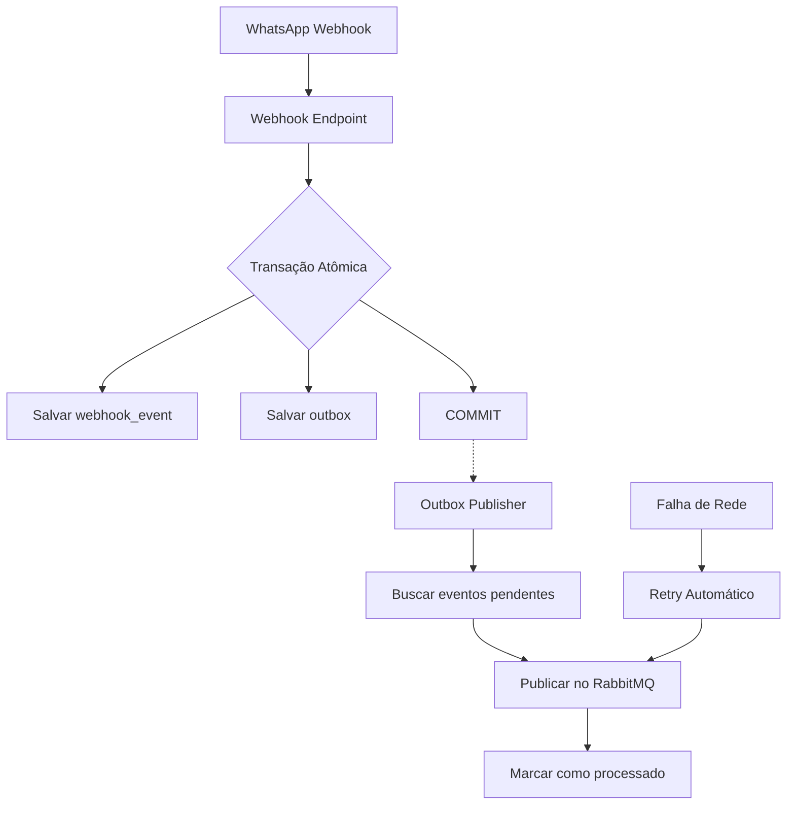

# Outbox Pattern - Implementação

Este documento descreve a implementação do **Outbox Pattern** no sistema WhatsApp Webhook para garantir atomicidade entre operações de banco de dados e publicação no RabbitMQ.

## 🎯 Problema Resolvido

### Antes (Problema):
```
Webhook recebido → Salva no banco → Publica no RabbitMQ
                     ✅              ❌ (falha de rede)
Resultado: Mensagem salva no banco mas NUNCA processada!
```

### Depois (Solução):
```
Webhook recebido → [TRANSAÇÃO: Salva no banco + outbox] → Publisher assíncrono → RabbitMQ
                      ✅ Atomicidade garantida              ✅ Retry automático
```

## 🏗️ Arquitetura

### Componentes

1. **Webhook Endpoint** (`app.py`): Salva eventos atomicamente
2. **Outbox Table** (MySQL): Armazena eventos para publicação
3. **Outbox Publisher** (`outbox_publisher.py`): Processa eventos assincronamente
4. **RabbitMQ**: Destino final dos eventos

### Fluxo Completo



## 🗃️ Estrutura da Tabela Outbox

```sql
CREATE TABLE outbox (
    id VARCHAR(36) PRIMARY KEY,           -- UUID único
    aggregate_id VARCHAR(255) NOT NULL,   -- ID da entidade (message_id, webhook_id)
    event_type VARCHAR(100) NOT NULL,     -- Tipo do evento (rabbitmq.webhook_received)
    payload JSON NOT NULL,                -- Dados do evento
    created_at TIMESTAMP NOT NULL,        -- Quando foi criado
    processed_at TIMESTAMP NULL,          -- Quando foi processado (NULL = pendente)
    
    INDEX idx_outbox_pending (processed_at, created_at),
    INDEX idx_outbox_aggregate (aggregate_id),
    INDEX idx_outbox_cleanup (processed_at)
);
```

## 🔄 Implementação

### 1. Salvamento Atômico

```python
# app.py - Webhook endpoint
def webhook():
    # ANTES: Publicação direta (não confiável)
    # rabbitmq_manager.publish_webhook_event('webhook_received', body)
    
    # DEPOIS: Outbox pattern (confiável)
    db_manager.save_webhook_with_outbox('webhook_received', body, message_id)
```

### 2. Processamento Assíncrono

```python
# outbox_publisher.py
class OutboxPublisher:
    def _process_outbox_batch(self):
        # 1. Buscar eventos pendentes
        events = db_manager.get_pending_outbox_events(limit=50)
        
        # 2. Processar cada evento
        for event in events:
            success = self._publish_to_rabbitmq(event)
            if success:
                processed_ids.append(event['id'])
        
        # 3. Marcar como processados
        db_manager.mark_outbox_as_processed(processed_ids)
```

## ⚙️ Configuração e Deploy

### 1. Deploy do Outbox Publisher

```bash
# Aplicar deployment
kubectl apply -f k8s/outbox-publisher-deployment.yaml

# Verificar status
kubectl get pods -n whatsapp-webhook -l app=outbox-publisher
```

### 2. Monitoramento

```bash
# Ver logs do publisher
kubectl logs -f deployment/outbox-publisher -n whatsapp-webhook

# Verificar métricas
kubectl top pod -n whatsapp-webhook -l app=outbox-publisher
```

## 📊 Características de Confiabilidade

### ✅ Garantias Fornecidas

1. **Atomicidade**: Webhook salvo no banco ⟺ Evento no outbox
2. **At-least-once**: Todo evento no outbox será processado
3. **Ordering**: Eventos processados em ordem de criação (FIFO)
4. **Retry**: Falhas temporárias são automaticamente reprocessadas
5. **Monitoring**: Logs detalhados e estatísticas

### 🔧 Parâmetros Configuráveis

```python
# outbox_publisher.py
batch_size = 50        # Eventos por batch
poll_interval = 5      # Segundos entre verificações
max_retries = 3        # Tentativas por evento
cleanup_days = 7       # Dias para manter eventos processados
```

## 🚨 Tratamento de Falhas

### Cenários Cobertos

1. **Falha na Transação**: Rollback automático - nenhum dado perdido
2. **Falha no Publisher**: Eventos permanecem pendentes - processados na próxima execução
3. **Falha no RabbitMQ**: Retry com backoff exponencial
4. **Falha de Rede**: Retry automático até sucesso
5. **Pod Restart**: Eventos pendentes são reprocessados automaticamente

### Logs de Monitoramento

```bash
# Exemplo de logs normais
✅ Webhook salvo no banco + outbox atomicamente
📦 Processando batch com 15 eventos
✅ 15 eventos marcados como processados
📊 OUTBOX PUBLISHER STATS: Total processados: 1,247

# Exemplo de logs de erro
❌ Erro ao publicar evento abc-123 (tentativa 1): Connection refused
⚠️ Falha ao publicar evento abc-123 (tentativa 2)
✅ Evento abc-123 publicado no RabbitMQ (tentativa 3)
```

## 🧹 Manutenção

### Limpeza Automática

O publisher remove automaticamente eventos processados com mais de 7 dias:

```sql
DELETE FROM outbox 
WHERE processed_at IS NOT NULL 
AND processed_at < DATE_SUB(NOW(), INTERVAL 7 DAY)
```

### Monitoramento Manual

```sql
-- Verificar eventos pendentes
SELECT COUNT(*) as pending_events 
FROM outbox 
WHERE processed_at IS NULL;

-- Verificar eventos antigos não processados
SELECT id, created_at, event_type 
FROM outbox 
WHERE processed_at IS NULL 
AND created_at < DATE_SUB(NOW(), INTERVAL 1 HOUR)
ORDER BY created_at;

-- Estatísticas por tipo de evento
SELECT 
    event_type,
    COUNT(*) as total,
    SUM(CASE WHEN processed_at IS NULL THEN 1 ELSE 0 END) as pending,
    AVG(TIMESTAMPDIFF(SECOND, created_at, COALESCE(processed_at, NOW()))) as avg_processing_time
FROM outbox 
GROUP BY event_type;
```

## 🔄 Próximos Passos (Roadmap)

### Fase 2: Particionamento por Conversa
- Implementar `x-consistent-hash` exchange
- Criar múltiplas filas particionadas por `conversation_id`
- Garantir ordem por conversa

### Fase 3: Auto-scaling
- Metrics baseadas no tamanho da outbox
- Horizontal Pod Autoscaler (HPA)
- Alertas para eventos pendentes há muito tempo

### Fase 4: Dead Letter Queue
- Eventos que falharam após todos os retries
- Análise e reprocessamento manual
- Notificações para administradores

## 🐛 Troubleshooting

### Publisher não está processando eventos

```bash
# 1. Verificar se o pod está rodando
kubectl get pods -n whatsapp-webhook -l app=outbox-publisher

# 2. Verificar logs
kubectl logs deployment/outbox-publisher -n whatsapp-webhook --tail=50

# 3. Verificar conexões
kubectl exec -it deployment/outbox-publisher -n whatsapp-webhook -- python -c "
from database import db_manager
from rabbitmq_manager import rabbitmq_manager
print('DB:', db_manager.get_connection_status())
print('RabbitMQ:', rabbitmq_manager.get_status())
"
```

### Eventos acumulando na outbox

```sql
-- Verificar quantidade de eventos pendentes
SELECT COUNT(*) FROM outbox WHERE processed_at IS NULL;

-- Verificar se há eventos antigos travados
SELECT * FROM outbox 
WHERE processed_at IS NULL 
AND created_at < DATE_SUB(NOW(), INTERVAL 10 MINUTE)
LIMIT 5;
```

### Reprocessar evento específico

```sql
-- Marcar evento como pendente novamente
UPDATE outbox 
SET processed_at = NULL 
WHERE id = 'uuid-do-evento';
```

## 📈 Benefícios Obtidos

1. **🔒 Confiabilidade**: Zero perda de mensagens
2. **⚡ Performance**: Processamento assíncrono não bloqueia webhook
3. **🔄 Resiliência**: Falhas temporárias são automaticamente recuperadas
4. **👁️ Observabilidade**: Logs e métricas detalhadas
5. **🎯 Escalabilidade**: Base para futuro particionamento

Este Outbox Pattern é a **Fase 1** da migração para uma arquitetura robusta e escalável!
