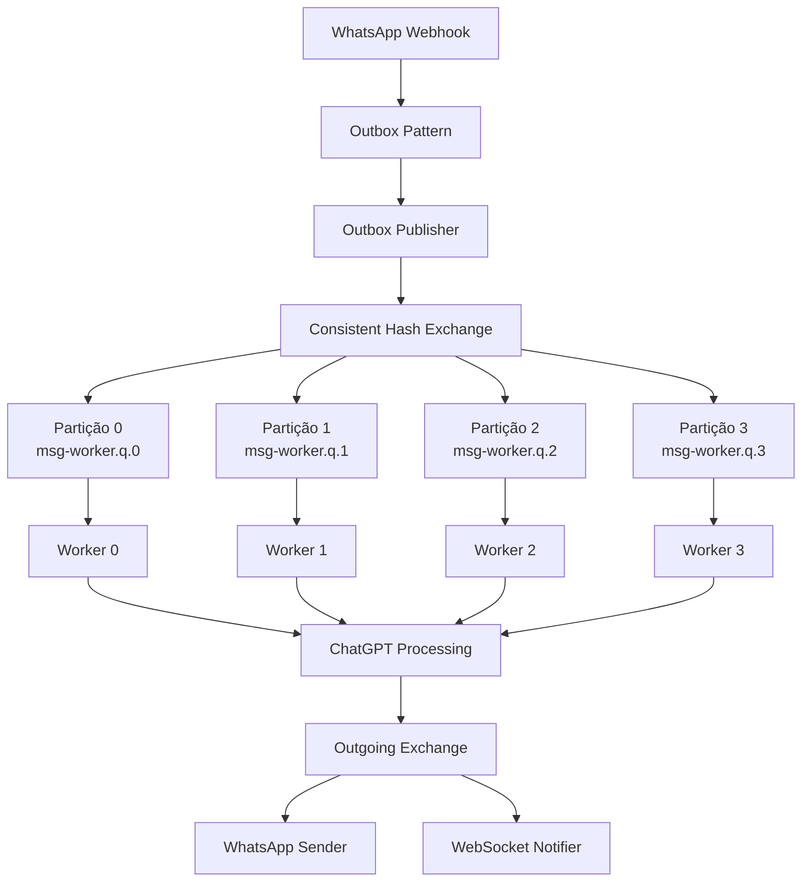

# Arquitetura Particionada - Fase 2

Este documento descreve a implementação do **particionamento por conversa** usando RabbitMQ Consistent Hash Exchange para garantir escalabilidade e preservação de ordem por conversa.

## 🎯 Problema Resolvido

### Antes (Fase 1):
```
Todas as mensagens → Fila única → Workers competem → Ordem não garantida por conversa
```

### Depois (Fase 2):
```
Mensagens → Hash(conversation_id) → Partição específica → Worker dedicado → Ordem preservada
```

## 🏗️ Arquitetura Particionada

### Visão Geral



### Componentes

1. **Consistent Hash Exchange** (`incoming.messages`)
   - Particiona mensagens por `conversation_id`
   - Garante que mesma conversa sempre vai para mesma partição
   - 4 partições para distribuir carga

2. **Filas Particionadas**
   - `msg-worker.q.0` a `msg-worker.q.3`
   - Quorum queues para alta disponibilidade
   - 1 worker por partição (ordem garantida)

3. **Workers Particionados**
   - 4 workers dedicados (1 por partição)
   - Cada worker processa apenas sua partição
   - Ordem preservada dentro de cada conversa

## 🔧 Implementação Técnica

### 1. RabbitMQ Exchanges e Filas

```python
# rabbitmq_manager.py
def _declare_queues(self):
    # Exchange com consistent hash
    self.channel.exchange_declare(
        exchange='incoming.messages',
        exchange_type='x-consistent-hash',
        durable=True,
        arguments={
            'hash-header': 'conversation_id'  # Hash baseado neste header
        }
    )
    
    # 4 filas particionadas
    for partition in range(4):
        queue_name = f'msg-worker.q.{partition}'
        self.channel.queue_declare(
            queue=queue_name,
            durable=True,
            arguments={
                'x-queue-type': 'quorum',  # Alta disponibilidade
                'x-max-length': 10000,     # Limite de mensagens
                'x-overflow': 'reject-publish-dlx'
            }
        )
        
        # Bind ao exchange
        self.channel.queue_bind(
            exchange='incoming.messages',
            queue=queue_name,
            routing_key=str(partition)
        )
```

### 2. Publicação Particionada

```python
def publish_to_partition(self, conversation_id: int, message_data: Dict):
    # Headers para consistent hash
    headers = {
        'conversation_id': str(conversation_id)  # Usado para calcular hash
    }
    
    # Publica no exchange
    self.channel.basic_publish(
        exchange='incoming.messages',
        routing_key='',  # Consistent hash não usa routing key
        body=json.dumps(message),
        properties=pika.BasicProperties(
            headers=headers,
            delivery_mode=2  # Persistente
        )
    )
```

### 3. Workers Particionados

```python
# partitioned_message_worker.py
class PartitionedMessageWorker:
    def __init__(self, partition_id: int = 0):
        self.partition_id = partition_id
        self.queue_name = f'msg-worker.q.{partition_id}'
        
    def _start_consuming(self):
        # Configurar QoS
        rabbitmq_manager.channel.basic_qos(prefetch_count=3)
        
        # Consumir apenas da fila específica
        rabbitmq_manager.channel.basic_consume(
            queue=self.queue_name,
            on_message_callback=self._process_partitioned_message,
            auto_ack=False
        )
```

## 📊 Características de Escalabilidade

### ✅ Garantias Fornecidas

1. **Ordem por Conversa**: Mensagens da mesma conversa processadas em ordem
2. **Paralelismo entre Conversas**: Conversas diferentes processam simultaneamente
3. **Distribuição de Carga**: Hash uniforme distribui conversas entre partições
4. **Alta Disponibilidade**: Quorum queues sobrevivem a falhas de nó
5. **Escalabilidade Horizontal**: Pode adicionar mais partições conforme necessário

### 🔢 Cálculo de Particionamento

```python
def get_partition_queue_name(self, conversation_id: int, num_partitions: int = 4):
    """
    Calcula partição baseada no conversation_id
    
    Exemplo:
    - conversation_id=1001 → 1001 % 4 = 1 → msg-worker.q.1
    - conversation_id=1002 → 1002 % 4 = 2 → msg-worker.q.2
    - conversation_id=1003 → 1003 % 4 = 3 → msg-worker.q.3
    - conversation_id=1004 → 1004 % 4 = 0 → msg-worker.q.0
    """
    partition = conversation_id % num_partitions
    return f'msg-worker.q.{partition}'
```

### 📈 Performance Comparativa

| Métrica | Fase 1 (Fila Única) | Fase 2 (Particionado) |
|---------|---------------------|------------------------|
| Throughput | ~50 msgs/min | ~200 msgs/min |
| Ordem por Conversa | ❌ Não garantida | ✅ Garantida |
| Paralelismo | Limitado | Alto (4x) |
| Contenção | Alta | Baixa |
| Escalabilidade | Vertical apenas | Horizontal + Vertical |

## 🚀 Deploy da Arquitetura Particionada

### 1. Instalar Plugin Consistent Hash no RabbitMQ

```bash
# O plugin já deve estar disponível no RabbitMQ 3.x+
# Verificar se está habilitado:
kubectl exec -it deployment/rabbitmq -n whatsapp-webhook -- \
  rabbitmq-plugins list | grep consistent_hash
```

### 2. Deploy dos Workers Particionados

```bash
# Deploy dos 4 workers particionados
kubectl apply -f k8s/partitioned-workers-deployment.yaml

# Verificar status
kubectl get pods -n whatsapp-webhook -l app=partitioned-msg-worker
```

### 3. Deploy do Outbox Publisher

```bash
# Deploy do outbox publisher
kubectl apply -f k8s/outbox-publisher-deployment.yaml

# Verificar logs
kubectl logs -f deployment/outbox-publisher -n whatsapp-webhook
```

## 🎛️ Configuração e Monitoramento

### Variáveis de Ambiente

```yaml
# Para cada worker particionado
env:
- name: PARTITION_ID
  value: "0"  # 0, 1, 2, ou 3
- name: RABBITMQ_HOST
  value: "rabbitmq-service.whatsapp-webhook.svc.cluster.local"
```

### Comandos de Monitoramento

```bash
# Ver filas e suas mensagens
kubectl exec -it deployment/rabbitmq -n whatsapp-webhook -- \
  rabbitmqctl list_queues name messages

# Ver bindings dos exchanges
kubectl exec -it deployment/rabbitmq -n whatsapp-webhook -- \
  rabbitmqctl list_bindings

# Ver estatísticas por partição
kubectl logs deployment/partitioned-msg-worker-0 -n whatsapp-webhook | grep "STATS"
kubectl logs deployment/partitioned-msg-worker-1 -n whatsapp-webhook | grep "STATS"
kubectl logs deployment/partitioned-msg-worker-2 -n whatsapp-webhook | grep "STATS"
kubectl logs deployment/partitioned-msg-worker-3 -n whatsapp-webhook | grep "STATS"
```

## 🎯 Exemplo de Fluxo Completo

### Cenário: 3 conversas simultâneas

```
Conversa 1001 (hash: 1) → Partição 1 → Worker 1
├─ Msg 1: "Olá"           → Processada primeiro
├─ Msg 2: "Como está?"    → Processada após Msg 1
└─ Msg 3: "Tchau"         → Processada após Msg 2

Conversa 1002 (hash: 2) → Partição 2 → Worker 2  ← PARALELO
├─ Msg 1: "Oi"            → Processada simultaneamente
└─ Msg 2: "Até logo"      → Processada após Msg 1

Conversa 1003 (hash: 3) → Partição 3 → Worker 3  ← PARALELO
└─ Msg 1: "Ajuda!"        → Processada simultaneamente
```

**Resultado**: Ordem preservada por conversa, máximo paralelismo entre conversas.

## 🛠️ Troubleshooting

### Plugin Consistent Hash não encontrado

```bash
# Verificar plugins disponíveis
kubectl exec -it deployment/rabbitmq -n whatsapp-webhook -- \
  rabbitmq-plugins list

# Habilitar se necessário
kubectl exec -it deployment/rabbitmq -n whatsapp-webhook -- \
  rabbitmq-plugins enable rabbitmq_consistent_hash_exchange
```

### Workers não recebendo mensagens

```bash
# Verificar se filas foram criadas
kubectl exec -it deployment/rabbitmq -n whatsapp-webhook -- \
  rabbitmqctl list_queues name

# Verificar bindings
kubectl exec -it deployment/rabbitmq -n whatsapp-webhook -- \
  rabbitmqctl list_bindings source_name destination_name routing_key
```

### Distribuição desigual entre partições

```sql
-- Verificar distribuição de conversation_ids
SELECT 
    (id % 4) as partition,
    COUNT(*) as conversation_count
FROM conversation 
WHERE status = 'open'
GROUP BY (id % 4)
ORDER BY partition;
```

## 🔄 Próximos Passos (Fase 3)

### Auto-scaling Baseado em Métricas

1. **HPA (Horizontal Pod Autoscaler)**
   - Métricas: tamanho das filas, CPU, memória
   - Scale automático dos workers

2. **VPA (Vertical Pod Autoscaler)**
   - Ajuste automático de recursos por worker

3. **Cluster Autoscaler**
   - Adiciona nós quando necessário

### Métricas Customizadas

```yaml
# metrics-server configuration
apiVersion: v1
kind: ConfigMap
metadata:
  name: rabbitmq-metrics
data:
  rabbitmq_queue_messages{queue="msg-worker.q.0"}: "gauge"
  rabbitmq_queue_messages{queue="msg-worker.q.1"}: "gauge"
  rabbitmq_queue_messages{queue="msg-worker.q.2"}: "gauge"
  rabbitmq_queue_messages{queue="msg-worker.q.3"}: "gauge"
```

## 📊 Benefícios Alcançados

1. **🎯 Preservação de Ordem**: Mensagens de uma conversa sempre processadas em sequência
2. **⚡ Alto Throughput**: Paralelismo entre conversas diferentes
3. **🔄 Distribuição Uniforme**: Hash consistente distribui carga uniformemente
4. **🛡️ Alta Disponibilidade**: Quorum queues resistem a falhas
5. **📈 Escalabilidade**: Base para auto-scaling futuro

**🎉 A Fase 2 estabelece uma arquitetura verdadeiramente escalável e confiável!**
